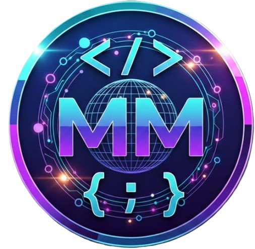

# Cyber-Premium Portfolio | Global Solutions Architect



A "World Class" bilingual portfolio built for a Global Solutions Architect specializing in secure, AI-driven software development.

## 🚀 Overview / Visão Geral

This project demonstrates a high-end personal brand identity focused on security, international compliance (GDPR/LGPD), and extreme performance. Built using the **Antigravity Intelligence** ecosystem to ensure code integrity and architectural excellence.

---

## 🛠 Tech Stack / Tecnologias

- **Structure:** HTML5 Semantic Markup
- **Styling:** Tailwind CSS (Custom "Cyber-Premium" Palette)
- **Animations:** AOS.js (Animate On Scroll) & Custom CSS Keyframes
- **Icons:** Lucide Icons & FontAwesome
- **Optimization:** Global Edge CDN Ready (Vercel/Cloudflare)
- **Intelligence:** Developed with Google Antigravity AI Skills

---

## ✨ Key Features / Recursos Principais

- **Bilingual (EN/PT):** Refined language switcher with instant UI updates.
- **Security First:** Highlighting SSL, OWASP Top 10, and Real-time Security Auditing.
- **Global Compliance:** Dedicated transparency for GDPR (EU) and LGPD (Brazil).
- **Mobile First:** Fully responsive "Cyber-Dark" design system.
- **Social Ready:** Integrated Open Graph (OG) and Twitter meta tags for international previews.

---

## 📂 Project Structure / Estrutura

```text
/TRABALHOS/portfolio/
├── assets/                       # Images and brand identity files
│   └── logo.png                  # Custom brand logo
├── index.html                    # Main production file (CSS/JS embedded)
├── robots.txt                    # Search Engine optimization
├── security_compliance_handbook.md # Professional document for clients
└── README.md                     # This documentation
```

---

## ⚙️ Setup & Deployment / Configuração

1. **Clone/Download:** Download the project files.
2. **Assets:** Ensure your `logo.png` is placed inside the `assets/` folder.
3. **Contact:** Open `index.html` and verify the WhatsApp link configured with your number (+55 92 993426359).
4. **Deploy:** Upload to any static hosting provider (Vercel, GitHub Pages, or Netlify).
    - *Pro Tip:* Use Vercel for maximum Edge CDN performance.

---

## 🛡 Security & Compliance Handbook

Included in this repository is a **[Security & Compliance Handbook](security_compliance_handbook.md)**. Use this professional Markdown document to present the architectural integrity of your software to your end clients, reinforcing the quality seal of **Antigravity Architectures**.

---

## 📩 Contact / Contato

Developed by **Marco M. | Global Solutions Architect**  
[Contact via WhatsApp](https://wa.me/5592993426359)

---
*Built with Antigravity Arch - Global Standard for Secure AI Development.*

